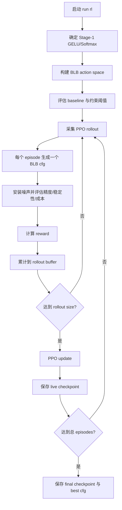

# BLB Stage-2 RL 全流程说明

本文档说明当前项目里的 BLB Stage-2 RL 如何作为旧 Stage-2 RL 的替换实现运行。
重点不是代码位置，而是从启动、搜索、停止、续训练到持久化目录的一整套运行逻辑。

当前约定：服务器运行时统一使用 `bash llama_7B_LayerImportance.sh ...`，不要直接调用底层训练入口。

## 1. 先用 preset 启动

已经新增 preset：

```text
presets/mrpc-blb-stage2-rl.conf
```

这个 preset 的定位是：固定 MRPC 的 Stage-1 GELU/Softmax 配置，只让 BLB Stage-2 RL
搜索噪声配置。它不包含 `--fresh`、`--fresh-stage1` 或 `--fresh-stage2`，这样第一次启动和后续续训练可以复用同一份 preset。

首次运行：

```bash
bash llama_7B_LayerImportance.sh run rl --preset mrpc-blb-stage2-rl --fresh
```

续训练：

```bash
bash llama_7B_LayerImportance.sh run rl --preset mrpc-blb-stage2-rl
```

只跑最高配置 final eval：

```bash
bash llama_7B_LayerImportance.sh eval --preset mrpc-blb-max-final-eval
```

`mrpc-blb-max-final-eval` 不做搜索。它把 Stage-1 固定为 MRPC 推荐 JSON 配置，把 Stage-2 直接解析为最大动作/最大 scaling-factor，并把 random 对照组数量设为 0，适合先快速看最高配置在统一 final-eval 下的效果。

脚本会自动后台运行。启动后会打印 PID、日志文件、错误摘要、`LATEST_RUN_DIR` 和
`LATEST_PID`。远程服务器上通常只需要保留这几项信息，后面查看日志、停止任务和续训练都用得到。

## 2. 启动后外壳做了什么

`llama_7B_LayerImportance.sh` 是唯一推荐入口。它负责把人类可读的参数整理成训练流程需要的内部参数，并在启动前做安全检查。

它主要做几件事：

1. 读取 preset，把 preset 里的参数放在前面，再把命令行参数放在后面。后面的命令行参数优先级更高。
2. 解析子命令，例如 `run rl` 表示单任务 RL 搜索。
3. 根据数据集、模型、算法和约束参数生成确定性的持久化目录。
4. 判断这是首次训练还是续训练。首次训练必须显式传 `--fresh`；续训练会自动复用已有目录。
5. 检查参数组合是否冲突，例如 `legacy_v2` 不能同时使用 BLB 专属参数。
6. 把 `--stage2-rl-variant blb_v3`、rollout size、保存间隔、Rescale invoker 等参数传入训练流程。
7. 用后台方式启动任务，并把 PID 写入 run 目录和 `rl_results` 下的 latest 文件。

对使用者来说，重点是：你不需要自己指定 `--resume-from` 来续训练。只要参数组合不变，脚本会找到同一个持久化目录。

## 3. 持久化目录如何确定

普通单任务 RL 的持久化目录形如：

```text
Parting Chapter/persistent/rl/{model_type}/{dataset}/s1t{stage1_tol}_s2t{stage2_limit_tol}_s2st{stage2_stability_tol}/
```

MRPC preset 默认对应：

```text
Parting Chapter/persistent/rl/bert-base/mrpc/s1t0.005_s2t0.005_s2st0.005/
```

这个目录是自动续训练的锚点。只要下面这些关键信息不变，就会回到同一个目录：

| 维度 | 例子 | 影响 |
| --- | --- | --- |
| 算法 | `rl` | 决定 persistent 下的分支 |
| 模型类型 | `bert-base` | 不同模型不会混用 checkpoint |
| 数据集 | `mrpc` | 不同任务不会混用结果 |
| Stage-1 容忍比例 | `0.005` | 参与目录 slug |
| Stage-2 指标容忍比例 | `0.005` | 参与目录 slug |
| Stage-2 稳定性容忍比例 | `0.005` | 参与目录 slug |

`--stage2-rl-variant` 不单独进入目录名。因此同一目录下切换 `blb_v3` 与 `legacy_v2`
时要谨慎。当前代码通过不同 checkpoint 文件名避免互相加载，但实验管理上仍建议同一持久化目录只跑一种 Stage-2 RL 变体。

## 4. 目录里会有什么

一次 BLB Stage-2 RL run 的关键目录如下：

```text
<run_dir>/
├── metadata.json
├── logs/
│   └── blb_stage2_rl.log
├── stage1/
├── stage2_noise/
│   ├── progress/
│   │   ├── blb_stage2_rl_checkpoint_live.pt
│   │   ├── blb_stage2_rl_checkpoint_final.pt
│   │   ├── blb_stage2_best_cfg.pkl
│   │   ├── blb_stage2_status.json
│   │   └── blb_stage2_episode_trace.csv
│   └── ...
└── stage2_noise_final_eval/
```

其中：

| 文件 | 作用 |
| --- | --- |
| `metadata.json` | 记录数据集、模型、约束、阶段状态、最近 PID 等 run 级信息 |
| `logs/blb_stage2_rl.log` | 训练日志，包含 baseline、reward 权重、episode 进度、best reward 等 |
| `blb_stage2_rl_checkpoint_live.pt` | 训练中的可续训 checkpoint，优雅停止和周期保存都会更新它 |
| `blb_stage2_rl_checkpoint_final.pt` | 正常完成后的最终 checkpoint；resume 时优先使用 |
| `blb_stage2_best_cfg.pkl` | 当前最优 BLB 配置和 action vector，给后续分析使用 |
| `blb_stage2_status.json` | live 状态板，包含当前阶段、best、baseline 和 warmstart 信息 |
| `blb_stage2_episode_trace.csv` | 每个 PPO rollout 的结构化诊断，记录 reward 分布、priority 计数、invalid 计数、anchor 计数和 PPO 指标 |
| `STOP_RL` | 手动创建的停止标志；不是默认存在的文件 |

## 5. BLB Stage-2 RL 的训练流程

BLB Stage-2 RL 的位置是在 Stage-1 配置确定之后。也就是说，它不负责搜索 GELU/Softmax
多项式次数，而是假设 Stage-1 已经给出一份固定配置，然后只搜索 Stage-2 的 BLB 噪声配置。

整体流程可以理解为：



下面展开每一段。

### 5.1 固定 Stage-1

BLB Stage-2 RL 需要一份固定 GELU/Softmax 配置。来源有三种：

| 来源 | 说明 |
| --- | --- |
| `stage1_result` | 使用同一个 run 里 Stage-1 搜索得到的结果 |
| `json` | 从合并配置 JSON 读取，适合只重跑 Stage-2 |
| `manual` | 命令行手动传 GELU/Softmax 数组，适合极少数调试场景 |

新增的 `mrpc-blb-stage2-rl` preset 默认用 `json`，并读取
`glue_final_configs_best_ppo.json`。这样可以跳过 Stage-1，只专注调 BLB Stage-2 RL。

### 5.2 构建动作空间

旧版 Stage-2 RL 的动作更接近“调几个 scaling factor”。BLB 版本的动作含义更细：
策略网络每个 episode 会选择一组离散动作，这些动作会被解码成 BLB 的 block/node
级噪声配置。

直观理解：

1. 每个动作头对应一个 BLB 噪声候选点。
2. 动作值不是直接的浮点噪声，而是一个离散挡位。
3. 挡位会根据 `max_sfs` profile 映射到实际配置。
4. 最终得到的是一份可以被 BLB 噪声桥接层应用的 cfg。

`blb_stage2_rl/max_sfs/default.json` 提供默认最大 SF 表。后续如果某个数据集有更精确的
profile，可以新增对应 JSON，让同一套训练流程使用更贴近真实 Rescale_optimizer 的上界。

### 5.3 Baseline 与约束

训练开始前会先建立 baseline。baseline 的作用不是参与优化，而是给 reward 和约束一个参照系。

主要包括：

| 信号 | 含义 |
| --- | --- |
| baseline metric/loss | 固定 Stage-1 后、不额外降低 BLB 噪声挡位时的任务表现 |
| accuracy threshold | Stage-2 候选配置允许的最差指标边界 |
| stability threshold | 噪声多次 trial 的波动上限 |
| baseline cost | 默认成本水平，用来衡量候选配置是否真的降低了开销 |

`--stage2-limit-tolerance` 控制指标能退让多少，`--stage2-stability-tolerance` 控制稳定性波动能放宽多少。
BLB 的 reward 会优先尊重这些硬约束：一个成本很低但精度崩掉的配置，不应该被当成好配置。

为了避免巨大动作空间的 uniform cold start 一开始全采到不可用配置，BLB v3 会先对 all-max BLB baseline action 做一次 preflight 评估，并把 policy 初始 logits 偏置到这份 action。首次训练的第一个 PPO rollout 默认会有一部分 episode 使用这份 baseline action 作为 anchor，其余 episode 仍正常采样，这样 PPO 能同时看到可用基线和探索配置的 reward 差异。

### 5.4 每个 episode 发生什么

一个 BLB episode 可以看成“一次候选配置尝试”。

1. Policy 根据当前状态采样一组动作。
2. 动作被解码成 BLB cfg。
3. 训练流程清理旧噪声状态，安装这份 BLB 噪声配置。
4. 在固定 probe 子集上跑评估。
5. 同一候选会做 `--stage2-k-trials` 次噪声 trial，用于估计稳定性。
6. Rescale invoker 给出成本信号，例如 bit 总量、fusion 数或非法链标记。
7. Reward 模块把精度、稳定性、成本合成一个标量回报。
8. 当前 transition 被放入 PPO rollout buffer。

这里最重要的是顺序：先看精度是否还在阈值内，再看稳定性，最后才鼓励成本下降。
这避免了策略为了降低 CKKS/MPC 成本而选择不可用的噪声配置。

### 5.5 Reward 的逻辑

BLB reward 是分层的，不是单纯“成本越低越好”。

第一层是可用性。候选配置必须让任务指标保持在阈值内。对分类任务通常关注 accuracy/F1
一类指标；对回归任务则按现有 evaluator 的任务指标解释。超出容忍范围会直接受到强惩罚。

第二层是稳定性。因为 Stage-2 是噪声配置，单次评估可能偶然好看，所以同一个候选会跑多次 trial。
如果波动超过阈值，说明这个配置不可靠，即使均值还可以，也不应该轻易成为 best。

第三层才是成本。只有在候选仍然可用且稳定时，降低 bit、fusion 或其他 Rescale 成本信号才会变成正向奖励。
这就是 BLB Stage-2 RL 与普通“压噪声成本”搜索的核心区别：它先保证可部署，再追求更低成本。

### 5.6 PPO rollout 与更新

`--stage2-rollout-size` 决定收集多少 episode 后做一次 PPO 更新。为了兼容旧 Stage-2 RL 的习惯，
如果没有显式设置它，shell 会让它跟随 `--ppo-update-interval`。

例如 preset 里两者都是 120，含义是：

1. 采集 120 个候选配置 episode。
2. 用这 120 条轨迹估计 advantage。
3. 更新 policy 和 value function。
4. 清空 rollout buffer，进入下一轮采集。

优雅停止也尽量贴近这个边界。收到停止请求后，BLB 不会粗暴打断当前评估，而是完成当前 episode，
写出 live checkpoint，再退出。

### 5.7 Best cfg 如何产生

训练中会持续维护当前最优候选。一个候选要成为 best，不能只看 reward 的瞬时值，还要满足约束逻辑：

1. 指标没有越过 Stage-2 容忍阈值。
2. 稳定性没有明显超标。
3. 成本信号相比 baseline 或当前 best 更优。
4. action vector 可以完整解码成 BLB cfg。

最终保存的 `blb_stage2_best_cfg.pkl` 用于分析和后续接入。为了兼容当前统一 final eval，
下游旧接口仍能拿到 legacy 形态的 Stage-2 结果；BLB 的完整最优配置则保存在 BLB 专属字段和 pkl 文件里。

## 6. Rescale optimizer 路径

BLB Stage-2 RL 训练固定使用真实 `Rescale_optimizer` in-process 路径，不再提供
`heuristic`、`stub` 或 `subprocess` 模式。每个 episode 的 CKKS 模数链、fusion_count 和
total_bits 都来自 `Rescale_optimizer` 的 replan 结果；如果 profile configs 或 baseline
archive 无法加载，runner 会直接报错停止训练。

## 7. 如何优雅停止

推荐方式是给启动脚本打印的 PID 发 SIGINT：

```bash
kill -INT <PID>
```

PID 可以从启动输出看，也可以读：

```text
rl_results/LATEST_PID
<run_dir>/rl.pid
<run_dir>/run.pid
```

另一种方式是在 BLB 进度目录创建停止标志：

```bash
touch <run_dir>/stage2_noise/progress/STOP_RL
```

两种方式的效果是一致的：训练流程会记录停止请求，等当前 episode 结束后保存 checkpoint，
更新 metadata 里的阶段状态，然后退出。

不要优先使用强杀。强杀虽然有时能立刻停下进程，但可能正好打断 checkpoint 写入或日志更新。

## 8. 如何续训练

续训练的原则很简单：同一组参数，再运行一次。

首次：

```bash
bash llama_7B_LayerImportance.sh run rl --preset mrpc-blb-stage2-rl --fresh
```

续训：

```bash
bash llama_7B_LayerImportance.sh run rl --preset mrpc-blb-stage2-rl
```

不要在训练模式手动传 `--resume-from`。这个参数主要留给 `eval` 或 `--mode eval` 读取已有结果。
普通训练续训由 launcher 自动完成。

BLB resume 时会优先找：

1. `<run_dir>/stage2_noise/progress/blb_stage2_rl_checkpoint_final.pt`
2. `<run_dir>/stage2_noise/progress/blb_stage2_rl_checkpoint_live.pt`

如果 final checkpoint 已经完成的 episode 数小于你这次指定的总 episode 数，就从那里继续往后跑。
如果已经达到或超过目标 episode 数，训练会认为 Stage-2 已完成。

## 9. 什么时候需要 fresh

`--fresh` 表示“我确认要清掉这个参数组合下已有持久化目录，从头开始”。它只应该出现在首次训练或明确重跑时。

| 操作 | 推荐命令 |
| --- | --- |
| 第一次跑一个新参数组合 | 加 `--fresh` |
| 从优雅停止处继续 | 不加 `--fresh` |
| 扩大 Stage-2 episode 总数继续训练 | 不加 `--fresh`，只覆盖 `--stage2-search-episodes` 或 `--episodes` |
| 只清空 Stage-2 重新搜 | 加 `--fresh-stage2` |
| 彻底重跑整个目录 | 加 `--fresh` |

preset 里不要写 `--fresh`。否则每次使用 preset 都会倾向于重置目录，不利于自动续训练。

## 10. 常见运行组合

使用 preset 首次启动：

```bash
bash llama_7B_LayerImportance.sh run rl --preset mrpc-blb-stage2-rl --fresh
```

使用 preset 续训练：

```bash
bash llama_7B_LayerImportance.sh run rl --preset mrpc-blb-stage2-rl
```

在 preset 基础上临时改变 Stage-2 总 episode：

```bash
bash llama_7B_LayerImportance.sh run rl --preset mrpc-blb-stage2-rl --stage2-search-episodes 120000
```

在 preset 基础上临时改变 rollout 大小：

```bash
bash llama_7B_LayerImportance.sh run rl --preset mrpc-blb-stage2-rl --stage2-rollout-size 240
```

切回旧 Stage-2 RL 做对照：

```bash
bash llama_7B_LayerImportance.sh run rl --dataset mrpc --stage2-rl-variant legacy_v2 --fresh
```

只做最终评估：

```bash
bash llama_7B_LayerImportance.sh eval --dataset mrpc --algorithm rl --config glue_final_configs_best_ppo.json
```

## 11. 建议的实验习惯

1. 每个正式实验先记录完整启动命令和 preset 版本。
2. 同一个持久化目录只跑一种 Stage-2 RL variant，避免实验语义混乱。
3. 训练日志里应能看到 `Rescale optimizer mode = in_process_real` 和 `Rescale_optimizer root = ...`。
4. 要改 `--stage2-limit-tolerance` 或 `--stage2-stability-tolerance` 时，把它当成新实验，因为目录 slug 会变。
5. 不要把 `--fresh` 写入长期 preset；它应该是一次性的确认动作。
6. 查看训练是否真的在续训时，重点看日志里的 resume 信息和 checkpoint 的 completed episodes。
7. 优雅停止后，确认 `blb_stage2_rl_checkpoint_live.pt` 更新时间，再启动续训。

## 12. 和旧 Stage-2 RL 的关系

从外壳看，BLB Stage-2 RL 应尽量像旧 Stage-2 RL：

| 能力 | 旧 Stage-2 RL | BLB Stage-2 RL |
| --- | --- | --- |
| 通过 `.sh` 后台运行 | 支持 | 支持 |
| 持久化目录自动续训 | 支持 | 支持 |
| `kill -INT` 优雅停止 | 支持 | 支持 |
| `STOP_RL` 标志停止 | 支持 | 支持 |
| live checkpoint | `noise_rl_checkpoint.pt` | `blb_stage2_rl_checkpoint_live.pt` |
| final checkpoint | 同旧 checkpoint 或最终状态 | `blb_stage2_rl_checkpoint_final.pt` |
| 动作含义 | legacy scaling factors | BLB block/node 噪声挡位 |
| 成本信号 | legacy 噪声配置评估 | BLB Rescale invoker 信号 |

因此，把 BLB 融入现有框架的原则是：外壳参数尽量沿用旧习惯，内部 checkpoint
和动作空间保持 BLB 独立。这样运行方式不变，实验语义也不会和旧实现混在一起。
