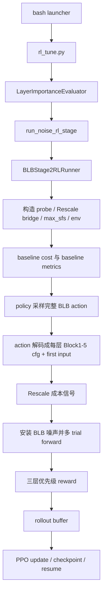
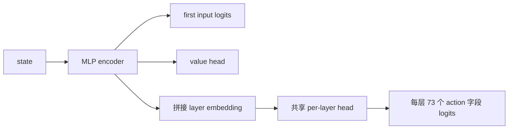

# BLB Stage-2 RL 内部全流程梳理

> **该读哪份？**
> - 只想跑训练 / 改 launcher 旗标 → `BLB_stage2_rl_README.md`
> - 想理解端到端运行逻辑（启动→停止→续训练→持久化） → `BLB_stage2_rl_FULL_FLOW.md`
> - 想看代码层调用栈 / 模块职责 / 单 episode 内部展开 → **本文**
> - 想看设计理由、数学约束、反例分析 → `BLB_stage2_rl_spec.md`

本文档描述当前项目中 `blb_v3` Stage-2 RL 的真实内部流程：参数如何进入训练、如何构造动作空间、一个 episode 内部发生什么、reward 如何分层、PPO 如何更新、checkpoint 如何保存与恢复，以及它如何与旧 Stage-2 RL 和统一 final-eval 共存。

本文只解释当前实现。它不是设计草案，也不假设未来会补齐的能力已经存在。

## 0. 总结先行

BLB Stage-2 RL 是旧 Stage-2 RL 的替换实现，但它替换的是“Stage-2 搜索外壳”，不是复用旧动作空间。

旧 Stage-2 RL 搜索的是 legacy `*_scaling_factors`。BLB Stage-2 RL 搜索的是一整份 BLB 噪声配置：每层 5 个 BLB block 的多个噪声点，再加 first-input fresh 噪声。当前实现把一个 episode 定义为“一次完整候选配置尝试”，也就是 horizon=1 的单步环境。Policy 每个 episode 一次性输出整份 BLB action vector，环境把它解码成 cfg、调用 Rescale 成本信号、安装 BLB 噪声、在 probe batch 上评估、计算 reward，然后立即清理噪声。PPO 收集多个这样的完整候选后做一次更新。

一句话流程：



## 1. 模块职责

BLB Stage-2 RL 不是一个单文件实现，而是由几层模块拼起来。

| 模块 | 角色 |
| --- | --- |
| `llama_7B_LayerImportance.sh` | 用户唯一推荐入口。解析 preset 和 shell 参数，生成持久化目录，后台启动训练，把 BLB 参数传给底层。 |
| `rl_tune.py` | Python 训练入口。接收 shell 传来的 `stage2_rl_variant` 与 BLB 参数，创建 `LayerImportanceEvaluator`。用户不直接调用它。 |
| `layer_importance_evaluator.py` | 总流程编排器。负责 Stage-1、Stage-2、final-eval 的阶段衔接；根据 `stage2_rl_variant` 路由到 BLB 或 legacy Stage-2 RL。 |
| `blb_stage2_rl/runner.py` | BLB Stage-2 RL 主训练器。负责配置解析、baseline、policy、训练循环、checkpoint、返回兼容结果。 |
| `blb_stage2_rl/env.py` | 单步 RL 环境。负责 action 到 cfg、Rescale 信号、安装噪声、模型评估、reward 调用、环境 state。 |
| `blb_stage2_rl/action_space.py` | BLB 动作空间定义与 action 解码。负责把离散 action vector 翻译成 Block1-5 cfg 和 first-input SF。 |
| `blb_stage2_rl/policy.py` | Actor-Critic 网络、rollout buffer 和 PPO update。 |
| `blb_stage2_rl/reward.py` | 三层优先级 reward：精度、稳定性、成本。 |
| `blb_stage2_rl/default_invoker.py` | `heuristic` Rescale invoker。外部 Rescale_optimizer 不可用时，用 cfg 字段估算成本。 |
| `blb_rl_bridge.py` | 把 BLB cfg 真正安装到模型的桥。负责 apply 与 clear。 |
| `rescale_optimizer_bridge.py` | 把 cfg 转成 Rescale optimizer 输入，调用 invoker，再聚合 total_bits、fusion_count、invalid_chain。 |

## 2. 从 shell 到 BLB runner

### 2.1 shell 入口做的事情

用户在服务器上运行：

```bash
bash llama_7B_LayerImportance.sh run rl --preset mrpc-blb-stage2-rl --fresh
```

shell 入口会做这些事：

1. 读取 preset 文件，把 preset 参数放在前面。
2. 把命令行追加参数放在后面，因此命令行可以覆盖 preset。
3. 解析子命令 `run rl`，确定算法是 `rl`。
4. 标准化 `--stage2-rl-variant`。`blb_v3`、`blb`、`v3` 都会归一成 `blb_v3`；`legacy_v2`、`legacy`、`v2` 会归一成 `legacy_v2`。
5. 校验 BLB 专属参数只能用于 `run rl`。
6. 如果选择 `legacy_v2`，又传了 BLB 专属参数，启动前直接报错。
7. 如果没有显式给 `--stage2-rollout-size`，就把它设成 `--ppo-update-interval`。
8. 根据算法、模型、数据集和约束参数确定持久化目录。
9. 用 `nohup` 后台启动底层 Python 训练命令，并写入 PID。

因此从用户角度看，BLB 和旧 Stage-2 RL 都是 `.sh` 后台运行；差异通过 `--stage2-rl-variant` 和 BLB 参数控制。

### 2.2 持久化目录先于训练确定

普通 RL 的持久化目录由 shell 决定，形如：

```text
Parting Chapter/persistent/rl/{model_type}/{dataset}/s1t{stage1_tol}_s2t{stage2_limit_tol}_s2st{stage2_stability_tol}/
```

目录名不包含 `stage2_rl_variant`。BLB 和 legacy checkpoint 文件名不同，所以技术上不会互相加载，但实验管理上建议同一个持久化目录只跑一种 Stage-2 RL 变体。

首次运行必须加 `--fresh`。如果目录已经存在且没有 fresh，shell 会把这个目录作为 `resume_run_dir` 传给训练流程。

### 2.3 `rl_tune.py` 只是承接参数

shell 内部会调用 `rl_tune.py`，但这是 launcher 的实现细节。`rl_tune.py` 接收并转发这些 BLB 相关参数：

| 参数 | 进入 evaluator 后的字段 |
| --- | --- |
| `--stage2_rl_variant` | `stage2_rl_variant` |
| `--blb_v3_inproc_rescale_optimizer_root` | `blb_v3_inproc_rescale_optimizer_root`，launcher 固定传 `Rescale_optimizer` |
| `--blb_v3_rollout_size` | `blb_v3_rollout_size` |
| `--blb_v3_eval_interval` | `blb_v3_eval_interval` |
| `--blb_v3_save_interval` | `blb_v3_save_interval` |
| `--blb_v3_calibrate_baseline_samples` | `blb_v3_calibrate_baseline_samples` |

这些字段会挂在 `LayerImportanceEvaluator` 实例上，后面由 `BLBStage2RLRunner` 读取。

## 3. Stage-2 入口如何选 BLB

`LayerImportanceEvaluator` 进入 Stage-2 时，会先确定固定的 Stage-1 配置，也就是一组 GELU/Softmax 多项式阶数。这个配置可能来自 Stage-1 搜索结果，也可能来自 JSON 或 manual 参数。

之后调用 `run_noise_rl_stage(fixed_gelu, fixed_softmax, fixed_label, fixed_source, resume_checkpoint_path=...)`。

这里有一个路由判断：

| `stage2_rl_variant` | 实际实现 |
| --- | --- |
| `blb_v3` / `blb` / `v3` / `blb_stage2_rl` | `BLBStage2RLRunner.run(...)` |
| `legacy_v2` / `legacy` / `v2` / `noise_rl_module_v2` | `NoiseRLModuleV2.run(...)` |

resume checkpoint 路径也按 variant 区分：

1. BLB 优先找 `stage2_noise/progress/blb_stage2_rl_checkpoint_final.pt`。
2. 找不到 final 再找 `stage2_noise/progress/blb_stage2_rl_checkpoint_live.pt`。
3. legacy 才找旧的 `stage2_noise/progress/noise_rl_checkpoint.pt`。

## 4. Runner 配置解析

`BLBStage2RLRunner` 进入后会先构造 `BLBStage2TrainConfig`。它不是单独的用户配置文件，而是从 evaluator 已有字段推出来。

| Runner 配置 | 当前来源 |
| --- | --- |
| `total_episodes` | `evaluator.stage2_rl_episodes` |
| `ppo.lr` | `evaluator.stage2_ppo_lr_initial` |
| `profile` | `evaluator.dataset_key`，例如 `mrpc` |
| `num_trials_per_step` | `evaluator.stage2_k_trials` |
| `rollout_size` | `evaluator.blb_v3_rollout_size`，shell 默认让它等于 `--ppo-update-interval` |
| `save_interval` | `evaluator.blb_v3_save_interval`，未设置则用 runner 默认 |
| `eval_interval` | `evaluator.blb_v3_eval_interval`，当前主要控制训练日志打印频率 |
| `calibrate_baseline_samples` | `evaluator.blb_v3_calibrate_baseline_samples` |
| `seed` | `evaluator.final_eval_random_seed` |
| `rescale_invoker_kind` | `evaluator.blb_v3_rescale_invoker_kind` |

注意一个当前实现细节：`eval_interval` 这个名字容易误导。当前 BLB runner 没有额外跑一套 deterministic evaluation；它是在 PPO update 后根据 `eval_interval / rollout_size` 的比例控制日志打印频率。

另一个当前实现细节：BLB env 的硬精度阈值默认不是直接使用 `stage2_limit_tolerance`。如果没有显式 `acc_threshold`，runner 会用 `baseline.metric1_mean - 0.01` 作为 BLB 训练内的精度阈值。`stage2_limit_tolerance` 仍会进入持久化目录 slug 和返回结果里的兼容字段，但 BLB env 内部 reward 阈值目前是这个 1pp fallback。

## 5. 训练前准备

### 5.1 固定 Stage-1 多项式近似

BLB Stage-2 RL 只搜索噪声，不搜索 GELU/Softmax。因此 runner 首先把 `fixed_gelu` 和 `fixed_softmax` 应用到模型上。

这一步之后，模型处于“已使用固定多项式近似，但还没有 BLB 噪声”的状态。后续每个 episode 都在这个基底上临时安装一份 BLB 噪声，评估完再卸载。

### 5.2 清理旧噪声残留

进入 BLB 训练前会防御式清理 legacy input noise。环境每次 `reset()` 时也会清理：

1. legacy input/query/key/value/wo/ffn/softmax value 等旧噪声。
2. 上一个 episode 可能残留的 BLB block 噪声。

这一步的意义是避免“上一个候选配置的噪声”和“当前候选配置的噪声”叠加，也避免 BLB 与 legacy 噪声同时存在。

### 5.3 构造 probe batches

BLB 训练不在完整验证集上每步评估，而是使用 evaluator 已有的 stability probe。

流程是：

1. 根据 reward reference split 选择数据 split。
2. 用 `stage2_probe_size` 取一个稳定性 probe 子集。
3. 用当前 batch size 和 data collator 构造 dataloader。
4. 只取前 `probe_batch_count` 个 batch。runner 默认 `probe_batch_count=4`。

所以一次 episode 的模型 forward 成本约等于：

```text
num_trials_per_step × probe_batch_count 个 mini-batch forward
```

其中 `num_trials_per_step` 来自 `--stage2-k-trials`。

### 5.4 构造 Rescale bridge

BLB reward 的成本部分来自 `RescaleOptimizerBridge`。runner 固定构造真实
`InProcessInvoker.from_profile(rescale_optimizer_root="Rescale_optimizer", profile=dataset)`。
不再支持 `heuristic`、`stub` 或 `subprocess` 作为训练路径；如果 profile configs 或
baseline archive 缺失，训练会直接报错停止。

### 5.5 加载 max-SF 表

动作不是直接给任意 scaling factor，而是先选离散挡位，再根据每个节点的 max SF 反推出实际 SF。

max SF 来源顺序：

1. `blb_stage2_rl/max_sfs/{profile}.json`
2. `blb_stage2_rl/max_sfs/default.json`
3. action_space 中每个字段的内置 default max SF

这个表的作用是告诉 RL：每个 block/node 的最高安全挡位大概是多少。动作 `idx` 越大，得到的 SF 越接近 max；动作 `idx` 越小，得到的 SF 越低，成本可能更低，但精度/稳定性风险更高。

### 5.6 创建 BLB 环境

`BLBStage2Env` 持有以下核心对象：

| 对象 | 作用 |
| --- | --- |
| `handler` | 实际替换模型层、安装/恢复噪声 |
| `model` | 被评估的 HF 模型 |
| `probe_batches` | 每个 episode 用来评估候选配置的小批数据 |
| `rescale_bridge` | 给候选 cfg 计算成本信号 |
| `baseline` | baseline cost/metrics，先占位，后面覆盖 |
| `reward_weights` | reward 权重，先占位，后面校准 |
| `max_sfs` | action idx 到实际 SF 的映射上界 |
| `gelu_degree` / `attn_degree` | 从固定 Stage-1 配置里取 dominant degree，用于 degree-aware block |
| `is_regression` | 决定 metric 计算方式 |

环境是单步环境。每个 `step(action)` 都会返回 `done=True`。

## 6. 动作空间

### 6.1 总体结构

BLB action vector 是 MultiDiscrete 风格的一维整数向量。它由两部分组成：

1. 每层的 Block1、Block2、Block3、Block4、Block5 动作字段。
2. 末尾一个 first-input fresh SF 动作。

单层字段数当前是：

| block | 字段数 | 说明 |
| --- | --- | --- |
| Block 1 | 9 | GELU out、FFN2、LN mean/var、多个 rescale、output truncation k |
| Block 2 | 23 | LN 输入、Q/K/V、mask、QKT、多个 rescale、output truncation k |
| Block 3 | 8 | attention polynomial softmax 相关 fresh/rescale、degree-aware square rescale、output truncation k |
| Block 4 | 17 | softmax/value/WO/LN 相关噪声和 rescale、output truncation k |
| Block 5 | 16 | FFN1/GELU polynomial/LN 相关噪声和 rescale、output truncation k |

每层合计 73 个离散动作字段。再加一个 first-input 动作。

例如 BERT-base 12 层时：

```text
总动作字段数 = 12 × 73 + 1 = 877
```

这里的 877 是“categorical 变量个数”，不是每个变量的候选值数量。每个字段可能有 3、4、5 等不同挡位。

### 6.2 动作字段类型

每个动作字段有一个 kind，kind 决定它有几个离散挡位。

| kind | 含义 | 挡位数 |
| --- | --- | --- |
| `F` | fresh noise scaling factor | 5 |
| `W` | weight encode scaling factor | 5 |
| `M` | mask encode scaling factor | 3 |
| `S` | scalar encode scaling factor | 3 |
| `R` | rescale scaling factor | 4 |
| `K` | truncation k | 4，实际值为 8、9、11、13 |
| first-input | first-input fresh SF | 5 |

### 6.3 action idx 如何变成 scaling factor

对 SF 字段，动作 idx 会按下面的逻辑变成实际 SF：

```text
sf = max_sf - 2 × (levels - 1 - idx)
```

直观理解：

| idx | 含义 |
| --- | --- |
| 0 | 最激进，SF 最低，成本可能最低，风险最高 |
| levels - 1 | 最保守，SF 等于 max，接近 baseline，风险最低 |

得到 SF 后，还会根据对应 N 的 noise variance table 做一次 snap：如果 SF 不在表里，就取表中小于等于它的最大合法值；如果没有更小值，就取表中最小值。这一步保证后面安装噪声时能查到方差。

### 6.4 degree-aware 的两个 block

Block3 和 Block5 与 Stage-1 多项式 degree 有关。

Block3 与 softmax/attention polynomial degree 有关。动作空间按最多 4 个 square rescale 槽位预留；实际构造 cfg 时会按当前 `attn_degree` 截断。

Block5 与 GELU polynomial degree 有关。当前只按 1、2、4 三类处理；如果传入其他值，会归到最接近的支持值。GELU power rescale 和 coeff mul rescale 的实际长度由 degree 决定。

### 6.5 首层 Block1 的特殊处理

首层 Block1 缺失输出 truncation 的语义，所以 layer 0 的 Block1 `output_truncation_k` 会被强制设成 `None`。动作向量里仍有这个槽位，但 decode 成 cfg 时不会作为有效 K 使用。计算平均 K 时也会跳过这个位置。

### 6.6 解码结果

一个 action vector 解码后得到：

| 结果 | 含义 |
| --- | --- |
| `block1_cfgs` | `{layer_idx: Block1NoiseConfig}` |
| `block2_cfgs` | `{layer_idx: Block2NoiseConfig}` |
| `block3_cfgs` | `{layer_idx: Block3NoiseConfig}` |
| `block4_cfgs` | `{layer_idx: Block4NoiseConfig}` |
| `block5_cfgs` | `{layer_idx: Block5NoiseConfig}` |
| `first_input_sf` | first-input fresh 噪声 scaling factor |
| `per_layer_field_values` | 调试用，记录每层每字段 decode 后的值 |

这些 cfg 是后续 Rescale 成本计算和实际安装 BLB 噪声的共同来源。

## 7. Policy 网络

当前 `BLBStage2Policy` 是一个共享 backbone 的 actor-critic。

它的输入是环境 state，输出三类东西：

1. 每层每个动作字段的 categorical logits。
2. first-input 动作的 categorical logits。
3. critic value。

内部结构可以理解为：



几个关键点：

1. 每层共用同一个 layer head，不是每层一套独立参数。
2. layer embedding 给网络提供层位置信息。
3. 每个动作字段都是独立 categorical，整个 action 的 log_prob 是所有字段 log_prob 之和。
4. deterministic 模式会取 argmax；训练采样时从 categorical 分布采样。
5. PPO 更新时会重新计算旧 action 在新 policy 下的 log_prob、entropy 和 value。

## 8. 环境 state

`BLBStage2Env` 的 state 是一个固定长度向量，长度为：

```text
state_dim = 6 + 4 + num_layers
```

当前实际构造包含这些信息：

| 部分 | 含义 |
| --- | --- |
| `attn_degree` | 当前固定 softmax/attention 近似 degree |
| `gelu_degree` | 当前固定 GELU 近似 degree |
| `num_layers` | 模型层数 |
| profile hash | profile 的简短数值编码 |
| last total bits norm | 上一个动作的 total_bits 相对 baseline 的比例 |
| last fusion count norm | 上一个动作的 fusion_count 归一化值 |
| last invalid rate | 上一个动作是否 invalid |
| step idx norm | 当前 step 计数的归一化值 |
| per-layer indicator | 每层一个简单位置指示 |

由于环境是 horizon=1，每个 episode 开头都会 `reset()`，但上一次 action 的成本反馈会留在 env 的内部状态里，作为下一次 state 的一部分。这让 policy 可以看到最近一次尝试的大致成本/invalid 情况。

## 9. Baseline 与权重校准

训练开始前 runner 会做两类 baseline。

### 9.1 baseline cost

baseline cost 使用“全 max action”计算。全 max action 表示每个字段都取最高挡位，也就是最保守、最接近低风险 baseline 的噪声配置。

baseline cost 会得到：

| 字段 | 含义 |
| --- | --- |
| `total_bits_sum` | 所有 block/layer 的 total_bits 之和 |
| `total_fusion_count` | 所有 block/layer 的 fusion_count 之和 |
| `avg_k` | baseline 平均 truncation k，当前为最高 K=13 |

然后 runner 会采样若干 random action，估计典型的 `bits_drop`、`fusion_count` 和 `k_drop`。这些值用于反推 reward 权重，让 bits、fusion、k 三类成本项的量级不要差得太离谱。

### 9.2 baseline metrics

baseline metrics 在“不安装 BLB 噪声”的状态下跑 probe batches。虽然没有 BLB 噪声时 forward 通常是确定的，代码仍按 `num_trials_per_step` 跑多次，以保持指标结构一致。

baseline metrics 会写回：

| 字段 | 含义 |
| --- | --- |
| `loss_mean` | baseline probe loss 均值 |
| `loss_std` | baseline 多 trial loss std |
| `metric1_mean` | 第一任务指标均值 |
| `metric2_mean` | 第二任务指标均值 |

如果 env 里没有显式精度阈值，当前实现会设：

```text
acc_threshold = max(0, baseline.metric1_mean - 0.01)
```

如果没有显式稳定性阈值，当前实现会设：

```text
stab_threshold = baseline.loss_std × 1.5 + 1e-3
```

这两个阈值直接决定 reward 的前两层硬约束。

## 10. 一个 episode 的完整内部流程

一个 BLB episode 是一次完整候选配置尝试。它不是“逐层一步一步走”的长 episode。

详细流程如下。

### 10.1 reset

每个 episode 开始先调用 env reset：

1. 尝试恢复 legacy input noise。
2. 尝试恢复 legacy query/key/value/wo/ffn/softmax value noise。
3. 清理上一次 BLB bridge 安装过的 block 噪声。
4. 如果传了 seed，则重置 torch、numpy、random seed。
5. 返回当前 state。

### 10.2 policy 采样动作

runner 把 state 变成 tensor，传给 policy。policy 采样一个完整 action vector，同时返回：

| 返回值 | 用途 |
| --- | --- |
| `action_vec` | 当前 episode 的完整 BLB 候选配置 |
| `log_prob` | PPO ratio 需要的旧 log probability |
| `value` | critic 对当前 state 的估值 |

### 10.3 action 解码

env 把 action vector 解码为每层 Block1-5 cfg 和 first-input SF。

这一步会处理：

1. 每个字段的 idx 到 SF 或 K 的转换。
2. max_sfs 表 lookup 和 fallback。
3. SF snap 到合法 noise variance table。
4. Block3/Block5 degree-aware 截断。
5. 首层 Block1 K 置空。

### 10.4 构造 Rescale 请求

解码后的 cfg 会被转成 optimizer requests：

```text
block{N}_{profile}_L{layer_idx} -> (block_name, cfg)
```

例如：

```text
block3_mrpc_L7 -> ("block3", layer7_block3_cfg)
```

每个 block/layer 都会形成一条请求。Rescale bridge 会把 cfg 转成 delta overrides，然后交给 invoker。

### 10.5 计算成本信号

Rescale bridge 返回每个 config 的输出，然后聚合为：

| 聚合字段 | 含义 |
| --- | --- |
| `total_fusion_count` | 所有 config 的 fusion_count 总和 |
| `total_bits_sum` | 所有 config 的 total_bits 总和 |
| `any_invalid` | 是否存在非法模数链 |
| `valid_block_count` | 合法 config 数 |
| `invalid_block_count` | 非法 config 数 |
| `per_config` | 每个 config 的详细信号 |
| `invalid_chains` | 非法链原因 |

成本信号来自真实 Rescale optimizer 的 replan 结果。`effective_rotations` 可能会被转换成
cfg 上的 `rotation_after_*` 标志，再影响后续 BLB 噪声安装。

### 10.6 invalid_chain 的快速失败

如果成本信号里有 `any_invalid=True`，env 不再安装噪声，也不跑 forward。它会直接构造一个失败 metrics：

```text
loss = inf
metric1 = 0
metric2 = 0
```

然后调用 reward，通常会先触发精度违反，得到很低的 reward。这样非法链不会浪费模型 forward 时间。

### 10.7 安装 BLB 噪声

如果没有 invalid，env 调用 `BLBNoiseRLBridge.apply(...)` 把 cfg 安装到模型上。

安装内容包括：

1. first-input fresh 噪声，默认装在 layer 0 入口。
2. Block1、Block2、Block4，按 cfg 分组后调用对应 handler 方法安装。
3. Block3、Block5 使用 `cfg_per_layer` 路径安装，因为它们与 degree 有关，每层 cfg 可能不同。

BLB 与 legacy 的互斥校验由 `ReversibleLayerHandler` 内部负责。如果发现 legacy 噪声残留导致 BLB apply 失败，env 会把这次 episode 当 invalid 处理。

### 10.8 多 trial forward

安装 BLB 噪声后，env 在 probe batches 上跑多次 trial。

每个 trial 内部：

1. 重新设置一个独立随机 seed，使噪声采样独立。
2. 遍历 probe batches。
3. 前向模型。
4. 根据任务类型计算 loss、metric1、metric2。

分类任务当前使用预测类别与 label 计算 accuracy 作为 metric。回归任务使用 MSE 形式的 loss，并把负 loss 作为“越大越好”的 metric。

所有 trial 结束后聚合：

| 聚合指标 | 含义 |
| --- | --- |
| `loss_mean` | 多 trial loss 均值 |
| `loss_std` | 多 trial loss 标准差，用于稳定性约束 |
| `metric1_mean` | 多 trial 第一指标均值 |
| `metric2_mean` | 多 trial 第二指标均值 |
| `loss_max` | worst-case loss |
| `metric1_min` | worst-case metric1 |
| `metric2_min` | worst-case metric2 |

评估结束后，无论 forward 是否正常，env 都会通过 `bridge.clear()` 清理这次安装的 BLB 噪声。

### 10.9 reward

env 把 metrics、cost signals、action 平均 K、baseline、阈值传给 `compute_reward`。reward 的逻辑见下一节。

### 10.10 更新下一次 state

reward 计算后，env 更新内部的 last cost/invalid 信息：

1. last total bits norm
2. last fusion count
3. last invalid rate
4. step index

然后返回新 state、reward、done=True、info。

`info` 里包含 decoded cfg、optimizer signals、metrics、reward breakdown 等诊断信息。runner 会用它维护 best。

## 11. Reward 的三层优先级

BLB reward 的核心原则是：先可用，再稳定，最后才省成本。

### 11.1 第一层：精度约束

先取 `metric1_mean` 作为精度指标。如果它低于 `acc_threshold`，直接触发 priority 1。

reward 形态是一个强惩罚加 dense 距离：

```text
reward = -priority1_penalty + (metric1 - acc_threshold) × priority1_scale
```

因为 `metric1 < acc_threshold`，第二项也是负的。离阈值越远，惩罚越重。

当前默认量级：

| 项 | 默认 |
| --- | --- |
| `priority1_penalty` | 100 |
| `priority1_scale` | 200 |

这确保精度崩掉的配置不会因为成本低而变成好配置。

### 11.2 第二层：稳定性约束

如果精度过关，再看 `loss_std`。如果 `loss_std > stab_threshold`，触发 priority 2。

reward 形态：

```text
reward = -priority2_penalty + (stab_threshold - loss_std) × priority2_scale
```

当前默认量级：

| 项 | 默认 |
| --- | --- |
| `priority2_penalty` | 50 |
| `priority2_scale` | 100 |

这一步防止某个配置平均表现尚可，但噪声 trial 之间波动很大。

### 11.3 第三层：成本优化

只有精度和稳定性都过关后，才进入成本 reward。

成本 reward 由三项组成：

| 项 | 含义 |
| --- | --- |
| `r_bits` | baseline total bits 减去当前 total bits，越省 bit 越好 |
| `r_fusion` | baseline fusion count 减去当前 fusion count，越少 fusion 越好 |
| `r_k` | baseline avg k 减去当前 action avg k，越低 k 越好 |

当前默认模式是 differential：

```text
reward = r_bits + r_fusion + r_k
```

如果成本没有改善，reward 可能接近 0 或为负；如果成本改善且硬约束过关，reward 才会明显变好。

### 11.4 invalid 的位置

`compute_reward` 里 invalid 是第三层 cost 前的检查。但由于 invalid 时 env 构造的 metric 通常会触发第一层精度失败，所以实际常见路径是：invalid 候选先因为 metric=0 被精度层重罚。

这也是当前实现的真实行为。

## 12. PPO 训练循环

### 12.1 rollout buffer 收集什么

每个 episode 结束后，runner 往 buffer 里放一条记录：

| 字段 | 含义 |
| --- | --- |
| `state` | 采样动作前的 state |
| `action` | 完整 BLB action vector |
| `log_prob` | 旧 policy 下该 action 的 log probability |
| `reward` | 本 episode reward |
| `value` | critic value |

因为环境 horizon=1，所以 return 就等于 reward，advantage 就是 `reward - value`。

### 12.2 什么时候 PPO update

当 buffer 长度达到 `rollout_size`，就做一次 PPO update。

PPO update 会：

1. 把 buffer 转成 tensors。
2. 计算 returns 和 advantages。
3. advantage 做标准化。
4. 按 minibatch 打乱采样。
5. 多轮 epoch 更新 policy/value。
6. 使用 PPO clipped objective。
7. 加 entropy bonus。
8. 做 value MSE。
9. 做梯度裁剪。
10. 清空 buffer。

当前 PPO 默认超参来自 `PPOConfig`：

| 超参 | 默认 |
| --- | --- |
| `clip_range` | 0.2 |
| `n_epochs` | 4 |
| `minibatch_size` | 64 |
| `ent_coef` | 0.02 |
| `value_coef` | 0.5 |
| `max_grad_norm` | 1.0 |

学习率会被 runner 从 evaluator 的 Stage-2 学习率覆盖。

### 12.3 best 如何更新

runner 当前用单 episode reward 来更新 best：

```text
if reward > best_reward:
    best_reward = reward
    best_action_vec = action_vec
    best_breakdown = reward_breakdown
    best_decoded_pickle = decoded cfg
```

这意味着 best 是训练过程中 reward 最高的候选，而不是额外经过大规模 final confirmation 的候选。它会保存 action vector、reward breakdown 和 decoded cfg pickle。

### 12.4 日志打印

PPO update 后，如果满足日志间隔，会打印类似：

```text
[BLB-v3] ep=... return mean=... max=... best=... policy_loss=... value_loss=... entropy=... clip_fraction=...
```

这里的 return mean/max 来自最近一个 rollout 的 episode rewards。它不是 final-eval 指标。

## 13. checkpoint、优雅停止与续训练

### 13.1 checkpoint 文件

BLB checkpoint 在：

```text
<run_dir>/stage2_noise/progress/
```

主要文件：

| 文件 | 触发时机 |
| --- | --- |
| `blb_stage2_rl_checkpoint_live.pt` | 周期保存、优雅停止保存 |
| `blb_stage2_rl_checkpoint_final.pt` | 正常训练结束 |
| `blb_stage2_best_cfg.pkl` | 正常训练结束且存在 best action 时 |
| `blb_stage2_status.json` | 训练期间持续刷新，供 live tail 查看 |
| `blb_stage2_episode_trace.csv` | 每个 PPO rollout 的 reward/priority/invalid/anchor/PPO 指标诊断 |

### 13.2 checkpoint 内容

BLB checkpoint 保存的不只是 policy。

| 字段 | 作用 |
| --- | --- |
| `policy` | actor-critic 网络权重 |
| `optimizer` | Adam optimizer 状态 |
| `episode` / `completed_episodes` | 已完成 episode 数 |
| `ppo_update_count` | 已完成 PPO update 次数 |
| `episode_returns` | 历史 episode reward |
| `best_reward` | 当前 best reward |
| `best_action` | 当前 best action vector |
| `best_breakdown` | 当前 best reward 分解 |
| `best_decoded_pickle` | 当前 best 解码结果 |
| `fixed_gelu` / `fixed_softmax` | Stage-2 固定的 Stage-1 配置 |
| `train_cfg` | 训练配置快照 |
| `rng_state` | torch/numpy/cuda RNG 状态 |
| `rl_variant` | 固定为 `blb_v3` |

有了 optimizer、episode、best 和 RNG，续训练可以尽量接着原来的轨迹继续。

### 13.3 优雅停止

runner 复用旧 `noise_rl_module_v2` 里的优雅停止机制。

两种触发方式：

1. 给进程发 SIGINT。
2. 在 progress 目录创建 `STOP_RL` 文件。

runner 会在训练期间检查停止请求。当前逻辑是：

1. 如果刚好完成 PPO update，或者 buffer 为空，就立即保存 live checkpoint 并退出。
2. 如果当前 rollout 还没收集完，会先记下“已收到停止请求”，等下一次 PPO update 边界保存后退出。

这样做的原因是：PPO buffer 里未更新的样本如果直接丢掉，训练状态会不完整；等到 rollout 边界保存更稳。

停止时还会把 persistent metadata 的 `stage2_search` 标记为 `in_progress`，并记录 completed episodes、total episodes、stopped_by 和 rl_variant。

### 13.4 续训练

续训练由 shell 的持久化目录机制触发，不建议训练模式手动传 `--resume-from`。

下一次使用同一组参数启动时：

1. shell 找到同一个 persistent run 目录。
2. 把它作为 resume run dir 传给 evaluator。
3. evaluator 根据 `stage2_rl_variant=blb_v3` 找 BLB checkpoint。
4. runner 加载 policy、optimizer、episode、best、历史 returns、RNG。
5. 从 `completed_episodes` 继续跑到新的 `total_episodes`。

如果 final checkpoint 的 completed episodes 已经达到目标 total episodes，则再启动不会产生额外训练意义；如果你增大 `--stage2-search-episodes`，它会从已有 checkpoint 继续跑到新的目标。

## 14. 正常结束后的清理与返回

训练循环完成后，如果 buffer 里还有未更新样本，runner 会做一次最后的 PPO update，然后保存 final checkpoint。

如果存在 best action，还会保存 `blb_stage2_best_cfg.pkl`。

之后 runner 会清理模型上的 BLB 噪声：

1. restore block5
2. restore block4
3. restore block3
4. restore block2
5. restore block1
6. restore first-input
7. 重新应用固定 GELU/Softmax

最终模型状态应该回到“固定 Stage-1 多项式近似，但不带 BLB 噪声”的干净状态。

## 15. 返回结果与 final-eval 兼容

这是当前实现非常重要的一点：BLB 的真实 best 配置不是 legacy `*_scaling_factors` 形状，而当前统一 final-eval 仍主要消费 legacy Stage-2 噪声配置。

为了不破坏现有 final-eval，runner 返回的 dict 里会构造 legacy 兼容字段：

| 字段 | 当前内容 |
| --- | --- |
| `best_noise_config` | legacy max-noise baseline 形状 |
| `stable_search_best_noise_config` | 同上 |
| `stable_joint_best_noise_config` | 同上 |

BLB 真正的结果放在 BLB 专属字段：

| 字段 | 内容 |
| --- | --- |
| `blb_v3_best_action_vec` | 最优 action vector |
| `blb_v3_best_reward` | 最优 reward |
| `blb_v3_profile` | profile，例如 `mrpc` |
| `rl_variant` | `blb_v3` |
| `selection_diagnostics.best_breakdown` | best 的 reward 分解 |
| `blb_stage2_best_cfg.pkl` | 落盘保存的 action/cfg/breakdown |

这意味着：当前统一 final-eval 不会直接把 BLB best cfg 当作 legacy scaling factors 使用。它会保持兼容，不让旧评估链路崩掉。BLB best 主要用于 BLB 后续分析或未来接入专门的 BLB final-eval。

如果只是想看“最高配置”的 final eval，现在可以显式使用 `--final-eval-source max`、`stage2-max` 或 `blb-max`。这条路径不会读取 BLB checkpoint，而是把 Stage-2 主评估配置直接解析成当前 unified final-eval 可执行的最大 scaling-factor 配置；Stage-1 仍从 JSON、search 或 manual 回退来源解析。

## 16. final_eval_only 读取旧结果时的 BLB 行为

当 `final_eval_only=True` 时，evaluator 会尝试从已有 checkpoint 读取搜索结果。

如果看到 legacy `noise_rl_checkpoint.pt`，它会读取旧的 `*_scaling_factors`。

如果看到 BLB 的 final/live checkpoint，由于 BLB best 不是 legacy scaling factor 形状，当前会回退为 `_get_max_noise_configuration()` 的 legacy baseline 兼容配置，并打印日志说明检测到了 BLB checkpoint。需要主动评估最高动作时，推荐使用 `mrpc-blb-max-final-eval` preset，而不是依赖 checkpoint 回退。

这也是为了保护现有 unified final-eval 的输入形状。

## 17. 失败路径与 fallback

BLB Stage-2 RL 内部有多个 fallback，目的是让训练流程尽量不中断。

| 情况 | 当前处理 |
| --- | --- |
| `max_sfs/{profile}.json` 不存在 | fallback 到 `default.json`，再 fallback 到字段内置 max |
| action SF 不在噪声方差表 | snap 到合法 SF |
| Rescale_optimizer root/configs/baseline 缺失 | 直接报错停止训练 |
| Rescale 输出 invalid_chain | 不安装 BLB，不跑 forward，直接负 reward |
| BLB apply 失败 | 当 invalid 处理，返回负 reward |
| probe 构造失败 | fallback 到 split 数据集本身 |
| checkpoint 读取失败 | 打 warning，从头继续该 run 的 BLB 训练状态 |
| checkpoint 保存失败 | 打 warning，但训练流程不会立刻崩 |

这些保护让 env 对非法动作保持稳健；Rescale_optimizer 初始化失败则不会被吞掉。

## 18. 当前实现中最容易误解的点

### 18.1 BLB episode 不是逐层 episode

Policy 一次性输出整份 action vector。一个 episode 是一份完整 BLB 配置，不是“先选 layer 0，再选 layer 1”的自回归过程。

### 18.2 `eval_interval` 当前主要是日志间隔

它没有额外跑 deterministic eval 来刷新 best。best 由训练 episode reward 更新。

### 18.3 Rescale_optimizer 是强依赖

BLB Stage-2 RL 不再有启发式成本估计兜底。训练日志应显示
`Rescale optimizer mode = in_process_real`；如果真实优化器加载失败，训练会直接中止。

### 18.4 final-eval 当前仍是 legacy 兼容

BLB best cfg 已保存，但统一 final-eval 目前不会直接消费 BLB cfg；返回结果里的 legacy best_noise_config 是 baseline 兼容配置。

### 18.5 BLB 与 legacy checkpoint 不共用

BLB 使用 `blb_stage2_rl_checkpoint_live.pt` 和 `blb_stage2_rl_checkpoint_final.pt`；legacy 使用 `noise_rl_checkpoint.pt`。resume 路径按 variant 选择。

### 18.6 Stage-2 tolerance 与 BLB reward 阈值当前不完全同源

持久化目录和返回结果会记录 `stage2_limit_tolerance`、`stage2_stability_tolerance`，但 BLB env 内部默认 hard threshold 当前由 baseline metric/std fallback 得到。若要让 BLB reward 精确遵循 CLI tolerance，需要后续把 tolerance 显式映射进 `acc_threshold` 和 `stab_threshold`。

## 19. 一次完整运行的状态流

从状态角度看，完整运行可以概括成：

1. shell 创建或恢复 persistent run dir。
2. evaluator 固定 Stage-1 配置。
3. runner 应用固定 GELU/Softmax。
4. env baseline 评估建立成本与指标参照。
5. policy 从当前 state 采样 action。
6. action 解码为 cfg。
7. cfg 进入 Rescale bridge 得到成本信号。
8. cfg 进入 BLB bridge 安装噪声。
9. model 在 probe 上多 trial forward。
10. env 清理噪声。
11. reward 按精度、稳定性、成本分层计算。
12. runner 把 transition 放入 PPO buffer。
13. buffer 满后 PPO 更新。
14. 周期保存 live checkpoint。
15. 收到停止请求时在安全边界保存并退出。
16. 正常结束保存 final checkpoint 和 best cfg。
17. runner 清理模型，返回 legacy 兼容结果和 BLB 专属诊断。
18. evaluator 进入统一 final-eval 或按参数跳过。

## 20. 推荐阅读顺序

如果后续要改 BLB RL，建议按这个顺序读代码：

1. `layer_importance_evaluator.py` 的 `run_noise_rl_stage`：先看怎么路由。
2. `blb_stage2_rl/runner.py` 的 `run`：看训练主流程。
3. `blb_stage2_rl/action_space.py`：看动作字段和解码。
4. `blb_stage2_rl/env.py`：看一个 episode 里如何安装噪声、评估、算 reward。
5. `blb_stage2_rl/reward.py`：看 reward 量级和优先级。
6. `blb_stage2_rl/policy.py`：看 policy 输出和 PPO update。
7. `blb_rl_bridge.py` 与 `rescale_optimizer_bridge.py`：看 BLB 安装和 Rescale 成本信号。

这样读能避免一开始陷入 cfg 字段细节，先抓住“外壳如何进入 BLB、BLB 如何把完整配置作为单步 episode 训练”的主线。
