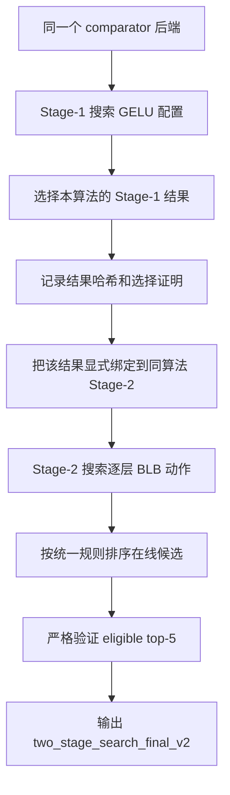

# Greedy 与 BO-RF：基础知识和项目实现说明

本文解释当前项目中作为 RL 对比算法的 Greedy 与 BO-RF。内容以
`jk_standard_rl` 的 `cfdd9a00406b43e2762685297ce4fd715a3ba451`
版本为准，覆盖 Stage-1、Stage-2、终止条件、断点恢复和严格结果选择。

## 先回答：能否设置最大轮数

可以，但两个算法应采用不同口径。

### BO-RF

BO-RF 天然具有“迭代”概念。初始设计完成后，每次循环：

1. 用已有真实评估数据重新训练随机森林代理模型；
2. 为候选池中的配置计算采集分数；
3. 选择一个新配置；
4. 对它做一次真实评估；
5. 将结果加入数据集，进入下一轮。

因此可以直接设置 `bo_max_iterations`。不过当前代码已经用
`evaluation_cap` 或 `evaluation_budget` 实现了更有意义的上限：它限制昂贵的
真实评估，而不是限制便宜的代理模型计算。

当前正式参数如下：

| 阶段 | 初始设计 | 候选池 | RF 树数 | 无改进耐心 | 真实评估上限 |
| --- | ---: | ---: | ---: | ---: | ---: |
| Stage-1 | 64 | 2,048 | 128 | 100 | 50,000 |
| Stage-2 | 64 | 2,048 | 128 | 100 | 50,000 次进入模型推理的评估 |

Stage-1 中，一次 BO 迭代对应一个新观测，所以最多有
`50,000 - 64 = 49,936` 次采集迭代。Stage-2 的预算只统计真正进入模型推理的
候选；优化器拒绝或无法物化的候选仍是观测，但不消耗推理预算，因此 Stage-2
的循环次数不一定严格等于 `50,000 - 64`。代码另有观测尝试保护上限，防止大量
候选在推理前失败而形成无限循环。

结论：BO-RF 已经有“最大轮数”的等价设置。若只是为了配置界面统一，可以新增
显式 `bo_max_iterations`，但它与真实评估上限重复。正式实验更适合继续使用真实
评估上限。

### Greedy

Greedy 没有“代”这一概念。最接近“轮”的单位是一次完整邻域扫描：

1. 扫描当前配置的全部 1-opt 邻居；
2. 若有更优配置，移动到最优邻居并重新扫描 1-opt；
3. 若 1-opt 无改进，扫描全部 2-opt 邻居；
4. 若接受 2-opt 移动，必须返回 1-opt；
5. 两个邻域都没有改进时，才证明当前起点到达局部最优。

技术上可以增加 `greedy_max_scans`，但达到它时只能标记为“预算中断”，不能标记
为“已收敛”。因为只扫描一部分邻居并不能证明局部最优，会削弱 Greedy 的正式
结果契约。

当前代码使用两个更合适的边界：

- 最大起点数：Stage-1 为 3 个统一锚点；Stage-2 使用 6 个统一锚点。
- 真实评估安全上限：Stage-1 为 `3^12 = 531,441`，Stage-2 为
  `6^12 = 2,176,782,336`，即各自完整搜索空间的大小。

这些上限不是要求穷举整个空间。缓存会复用重复邻居，搜索通常会在远低于上限时
完成。正式完成条件仍是：每个配置起点的完整 1-opt 和 2-opt 邻域都经过验证。

结论：Greedy 可以增加最大扫描轮数，但不应把到达该上限当作正常收敛。当前的
“评估上限 + 完整邻域证明”比固定轮数更严谨。

## 为什么不能直接比较三种算法的轮数

三种算法的一轮工作量不同：

| 算法 | 一轮的自然含义 | 一轮新增真实评估量 |
| --- | --- | ---: |
| GA | 更新一代种群 | 当前 P64/E7 下为 57 个新个体 |
| BO-RF | 代理模型提出一个新点 | 通常为 1 个 |
| Greedy | 扫描一个完整邻域 | 取决于邻域大小和缓存 |

对于 12 层搜索：

- Stage-1 每层 3 种 GELU 类别，1-opt 有 `12 x 2 = 24` 个邻居，2-opt 有
  `C(12,2) x 2 x 2 = 264` 个邻居。
- Stage-2 每层是 6 种原子动作，1-opt 有 `12 x 5 = 60` 个邻居，2-opt 有
  `C(12,2) x 5 x 5 = 1,650` 个邻居。

缓存会减少重复真实评估，但“轮数”仍不能作为公平预算。项目应继续用以下指标
比较算法：

- 独立真实模型评估次数；
- 进入模型推理的候选数；
- 总 GPU 推理次数；
- 端到端墙钟时间；
- 在相同严格约束下得到的最终结果。

## 项目中的共同搜索目标

Greedy 与 BO-RF 都不是单纯寻找最低损失。它们解决的是约束优化问题：

> 在模型质量和稳定性满足限制的前提下，寻找资源成本更低或资源收益更高的配置。

真实候选按“可行优先”排序：

1. 合法且满足全部约束的候选高于不可行候选；
2. 在可行候选中优化资源目标；
3. 若没有可行候选，优先选择失败约束更少的候选；
4. 再比较总违反量和最坏违反量；
5. 非法或没有完成模型前向的结果不能冒充正式最优结果。

两种算法使用相同的真实评估器和候选排序规则，差别只在于如何提出下一个候选。

## 两阶段搜索链路



`bo_rf` 必须消费 `bo_rf` 自己的 Stage-1 结果，`greedy` 也必须消费
`greedy` 自己的结果。Stage-1 结果哈希、选择哈希和 Stage-2 消费来源会一起
保存，防止算法之间误用配置。

正式实验还要求：

- 模型和数据集固定为 `textattack/bert-base-uncased-MRPC` 与 GLUE MRPC；
- 12 层；
- Stage-1 loss/accuracy/weighted-F1 相对容差均为 0.001；
- Stage-2 使用 6 个点值/稳定性约束；
- 在线评估每个动作 3 trials；
- 最终严格验证 eligible top-5；
- 严格验证基础、promotion 和 final bank 各使用规定的独立 trials；
- 可选 Paean final-eval 失败不能抹掉 authoritative strict-F4 结果。

## Greedy 基础知识

### 直觉

Greedy 局部搜索从一个已有配置出发，查看附近是否存在更好的配置。如果有，就走到
其中最好的一个；不断重复，直到附近没有更好配置。

它像沿着离散地形上坡：每一步都选择当前邻域中最好的方向，但它只知道附近，不能
保证到达全局最高点。因此项目采用多个相距较远的统一起点，并同时检查 1-opt 和
2-opt 邻域，降低困在较差局部最优点的风险。

### 1-opt、2-opt 与 best-improvement

- 1-opt：一次只修改一层。
- 2-opt：一次同时修改两层。
- best-improvement：先完整评估邻域，再选择其中最优的一步。
- first-improvement：遇到第一个更优点就移动。当前项目不使用这种较弱策略。

完整扫描是重要的正确性条件。若只看部分邻居就停止，无法证明没有遗漏更优点。

### 当前 Stage-1 Greedy

Stage-1 染色体是 12 个类别，每层类别解码为 GELU degree 4、2 或 1；Softmax
固定为 degree 6。搜索空间大小为 `3^12`。

三个起点是：

- 所有层 GELU degree 4；
- 所有层 GELU degree 2；
- 所有层 GELU degree 1。

每个起点执行：

```text
current = 起点
循环:
    完整评估 current 的 1-opt 邻域
    如果存在更优点:
        current = 最优的 1-opt 点
        继续循环

    完整评估 current 的 2-opt 邻域
    如果存在更优点:
        current = 最优的 2-opt 点
        返回 1-opt

    记录该起点已经验证局部最优
    结束该起点
```

只有三个起点都留下完整证明记录，Stage-1 Greedy 才能以
`verified_local_optimum` 正式完成。若评估预算提前耗尽，则结果是
`evaluation_cap`，正式完成契约会拒绝它。

### 当前 Stage-2 Greedy

Stage-2 每层的动作由两个耦合坐标组成：Block4 fusion 二选一，H/M/L preset
三选一。代码把它们编码成一个不可拆分的 6 值原子基因，避免只改变半个层动作。
12 层搜索空间为 `6^12`。

Stage-2 从 6 个“所有层使用相同原子动作”的统一锚点开始，也执行完整 1-opt、
完整 2-opt 和接受 2-opt 后返回 1-opt。所有起点都完成时，终止原因是
`verified_local_optima`。正式 runner 会拒绝任何没有完成邻域证明的 Greedy
搜索。

### Greedy 的优缺点

优点：

- 逻辑直观；
- 不需要训练代理模型；
- 完成时可证明对定义好的 1-opt/2-opt 邻域是局部最优；
- 固定起点、固定邻居顺序和缓存使恢复结果可复现。

局限：

- 不能保证全局最优；
- 2-opt 邻域较大，单次扫描可能昂贵；
- 固定最大扫描轮数会破坏局部最优证明；
- 多个起点可能访问重叠候选，虽有缓存复用，仍可能需要较多真实评估。

## 贝叶斯优化基础知识

### 它解决什么问题

当一次真实评估很贵，例如需要把配置安装进 BERT、运行 GPU 推理并统计多次噪声
trial 时，无法随意穷举全部配置。贝叶斯优化的核心思想是：

> 用一个便宜的模型学习“配置到评估结果”的近似关系，再把下一次昂贵评估花在最有
> 希望或最有信息价值的配置上。

这个便宜模型称为代理模型（surrogate model）。决定下一个真实评估点的规则称为
采集函数（acquisition function）。

### 标准循环


代理模型不会替代真实评估。它只负责决定“下一次应该评估谁”。最终报告中的质量、
约束和资源结果都来自真实评估及后续严格验证，而不是随机森林预测值。

### 为什么使用随机森林

当前搜索空间是离散类别而不是连续实数，并且配置到模型表现的关系可能不平滑。
随机森林适合这种场景：

- 能处理非线性和变量交互；
- 不要求目标函数可导；
- 多棵树的预测分歧可作为不确定性信号；
- 对类别 one-hot 特征使用方便；
- 相比昂贵模型推理，训练森林的成本通常较小。

“RF”就是 Random Forest。当前正式配置使用 128 棵回归树，叶节点最少 2 个
样本，并启用 CPU 并行 `n_jobs=-1`。

### 本项目预测的不是单一分数

Stage-1 随机森林预测归一化约束 margin：

- loss 距离允许上限还有多少余量；
- accuracy 距离允许下限还有多少余量；
- weighted-F1 距离允许下限还有多少余量。

Stage-2 预测 6 个约束 margin：三个均值约束和三个稳定性约束。margin 大于等于
0 表示满足该约束，小于 0 表示违反。

每棵树都会给出预测。由所有树可以计算：

- 可行概率 PoF：同时预测所有 margin 非负的树所占比例；
- 预测违反约束数量；
- 预测总违反量；
- 预测最坏违反量；
- 树间标准差，作为不确定性信号。

### 采集函数如何选点

项目分两种状态。

#### 已经找到可行候选

优先最大化：

```text
PoF x deterministic improvement
```

Stage-1 的 improvement 是候选相对当前最佳可行候选的确定性成本改善；Stage-2
则是资源收益改善。这里的 improvement 由候选配置对应的确定性资源模型计算，
不是经典高斯过程 BO 中对目标分布做积分得到的 EI。

主分数相同时，再按以下信息打破平局：可行概率、树间不确定性、资源目标和固定的
字典序。因此同一 seed 下结果可复现。

#### 尚未找到可行候选

此时没有可行 incumbent 可用于计算资源改善。项目严格按以下顺序选择最接近可行
区域的候选：

1. 预测失败约束数量更少；
2. 预测总违反量更小；
3. 预测最坏违反量更小；
4. 可行概率更高；
5. 不确定性、资源目标和固定字典序仅用于后续平局处理。

这样可以避免在完全不可行阶段盲目追求低成本或高资源收益。

### 候选池

每轮不对完整指数空间打分，而是构造 2,048 个候选再排序。

Stage-1 候选池包含当前高排名观测附近的 1-opt/2-opt 候选，并用随机未见配置补足。
Stage-2 候选池约一半来自全局均匀采样，一部分来自高排名候选附近的原子 1-opt，
其余再用全局采样补足。这在局部利用和全局探索之间取得平衡。

### 初始设计

代理模型在没有数据时无法训练。因此先真实评估 64 个结构化、尽量分散的配置，
然后才进入逐点 BO。Stage-1 使用 structured maximin 设计；Stage-2 也使用包含
安全点、最大资源点和分散样本的结构化初始设计。

### BO-RF 的停止条件

当前正式 BO-RF 有三种正常停止：

- 连续 100 次进入推理的新候选没有改善全局 incumbent；
- 达到 50,000 次真实评估/推理预算；
- 候选空间全部耗尽。

Stage-2 另有 observation attempt guard，用于防止过多候选在推理前失败。该保护
触发代表搜索契约不完整，不能伪装成 BO 正常收敛。

需要注意，“100 次无改进”比较的是项目统一的真实候选排序，而不是只比较单一
loss，也不是随机森林训练损失。

### BO-RF 的优缺点

优点：

- 每轮通常只花一次新的昂贵真实评估；
- 能利用历史数据避免完全随机搜索；
- 同时处理可行性、资源目标和预测不确定性；
- 适合离散、不可导、评估昂贵的黑盒问题。

局限：

- 代理模型可能预测错误；
- 每加入一个观测都重新训练森林，观测很多时 CPU 成本会上升；
- 候选池只是完整空间的子集，可能暂时看不到真正最优点；
- 100 次无改进是工程收敛判据，不是全局最优证明；
- 它比 Greedy 更难直观解释每一步为什么移动。

## 断点恢复与结果可靠性

Greedy 和 BO-RF 都把每个独立观测追加写入 JSONL，并记录 checkpoint、历史、
seed 和搜索配置。恢复时按原顺序重放观测：

- 已完成配置不会重复做昂贵推理；
- 若恢复后的算法请求顺序与原轨迹不同，会直接报错；
- BO 的随机数状态可由固定 seed 和相同观测顺序重建；
- Greedy 的邻域顺序和起点顺序固定；
- 只有完成算法自身契约，runner 才会发布正式完成产物。

Stage-2 在线搜索结束后，不直接把代理模型预测或普通 online best 当作最终科研
结果。系统会选择 optimizer-valid、可物化、实际执行过模型前向的 eligible top-5，
再进入独立严格验证。若严格验证完成但没有可行候选，才返回经过严格评估的
least-violating candidate，并明确标记 `formal_feasible=false`。

## 建议的参数表达方式

若以后希望配置界面更统一，建议采用下面的命名，不改变当前科学语义：

| 算法 | 推荐主上限 | 可选辅助上限 | 达到辅助上限时的语义 |
| --- | --- | --- | --- |
| GA | `max_generations` | `evaluation_budget` | 只有满足正式代数契约才算完成 |
| BO-RF | `evaluation_budget` | `max_acquisition_iterations` | 预算停止，不等于全局最优 |
| Greedy | `evaluation_budget` | `max_neighborhood_scans` | 中断/不完整，不能声称局部最优 |

正式比较应把真实模型评估预算作为第一口径，把轮数仅作为算法内部诊断。这样既能
控制运行时间，也不会让工作量完全不同的“轮”产生虚假的公平性。

## 当前实现位置

- Stage-1 搜索空间、候选排序、Greedy、BO-RF 和正式参数：
  `stage1_rl/search_baselines.py`
- Stage-1 完成契约、断点恢复和产物持久化：
  `stage1_rl/search_runner.py`
- Stage-2 原子动作空间、候选排序、Greedy 和 BO-RF：
  `blb_stage2_rl/search_baselines.py`
- Stage-2 严格 top-5、完成契约和恢复：
  `blb_stage2_rl/search_baseline_runner.py`
- Stage-1 结果到同算法 Stage-2 的显式绑定和最终产物：
  `blb_stage2_rl/sequential_runner.py`
- 正式模型、数据集、预算和 trial 合同校验：
  `layer_importance_evaluator.py`
